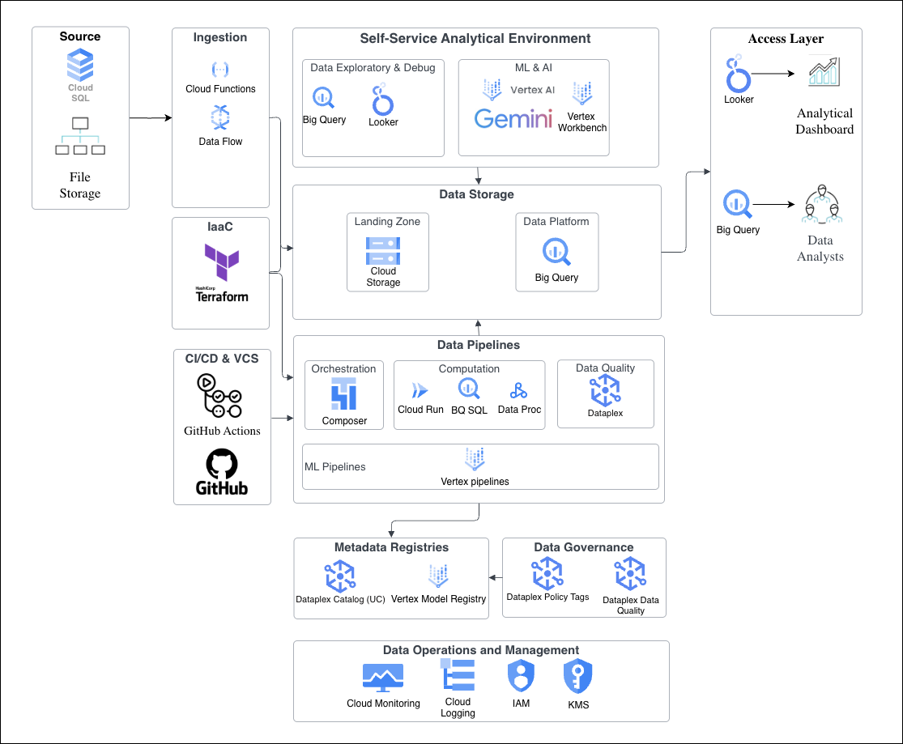

# Solution Summary

This is a production-minded batch analytics platform for fee analytics. The architecture is designed for operational reliability, data correctness, and trust-sensitive use cases. It separates concerns (bronze/silver/gold medallion pattern), enforces data quality, and provides a clear path to evolve into an enterprise-grade platform.

## Key Assumptions

| Assumption | Rationale |
|-----------|-----------|
| **Schema**: Input schema is stable (client_id, client_nino, adviser_id, fee_date, fee_amount) | Enforced via Terraform table definitions. Breaking changes will need explicit schema migration.|
| **Data Refresh**: Full daily refresh (not incremental) | Simplicity and correctness. When data size hits cost threshold, we can switch to incremental loads with MERGE. |
| **Audit Trail**: Excluded audit columns in the current scope | Audit trail would have been ideal for incremental loads where traces can be found. |
| **Data Governance**: PII data is masked for all | For simplicity, we have assumed that nino should be masked for everyone. For production, we can use Dataplex to create policy tags and data policies to implement dynamic masking. |
| **Negative Fees**: Treated as valid corrections/refunds | Assumed that use negatives for reversals is intentional and stripping them out would hide real corrections and break reconciliation |
| **Adviser Attribution**: All advisers are credited for fees during their tenure | If a client switches the advisers, all the advisers' LTV reflects their period |
| **Deduplication**: Exact row match only (all columns identical) | Catches accidental duplicates while preserving intentional corrections (same date, different amount is a separate adjustment) |
| **Client Lifetime**: Anniversary-based months (DATE_DIFF on calendar months) | If first fee is May 15, month 2 starts June 15 (not June 1). Ideal to implement and reason about than rolling 30-day windows |
| **UT**: Manual UT will be used| In production, we can implement via PyTest and integrate it with CI pipeline |

---

## Architecture

**Bronze → Silver → Gold Medallion Pattern**

```
Raw CSV (GCS)
    ↓
[BRONZE: fees_raw]
  - Raw data, full refresh daily
  - CREATE OR REPLACE = idempotent
  
[SILVER: fees_clean]
  - Deduplicated (exact matches only)
  - Enriched: first_fee_date, month_number
  - NINO hashed for PII compliance
  
[GOLD: client_ltv, adviser_ltv]
  - Aggregated metrics
  - Analytics-ready
  
[DATA QUALITY CHECKS]
  - Null validation, duplicate detection
  - Non-blocking for MVP
```

---

## Data Model

### client_ltv Table
Aggregates fees by client, calculated from month of first fee:

```
client_id (STRING)          - Client identifier
cohort_month (INTEGER)      - Month of first fee (1-12)
cohort_year (INTEGER)       - Year of first fee
ltv_1m (NUMERIC)            - Sum of fees in month 1
ltv_3m (NUMERIC)            - Sum of fees in months 1-3
ltv_6m (NUMERIC)            - Sum of fees in months 1-6
```

**Logic:**
- `first_fee_date` calculated using window function: `MIN(fee_date) OVER(PARTITION BY client_id)`
- `month_number` = `DATE_DIFF(fee_date, first_fee_date, MONTH) + 1`
- LTV values are cumulative sums grouped by `month_number` threshold

### adviser_ltv Table
Aggregates total 6-month LTV by adviser:

```
adviser_id (STRING)         - Adviser identifier
total_6m_ltv (NUMERIC)      - Sum of all client LTVs (first 6 months only)
```

**Attribution:** All fees where `month_number <= 6` credited to transaction's adviser_id.

---

## Data Quality Checks

Added in `sql/dq/data_quality_checks.sql`:

1. **Null checks** - Verifies required fields (client_id, adviser_id, fee_date, fee_amount) are not null
2. **Duplicate detection** - Identifies exact duplicate rows (all columns match)
3. **Negative fee monitoring** - Logs but allows negative fees (valid corrections)

**Handling:** Checks run post-transformation and are non-blocking (logs results, pipeline continues). In production, critical checks (nulls, duplicates) would block the load.

---

## Production Evolution

This solution establishes a very good foundation. The following enhancements can be added to make it an enterprise ready data platform:

| Capability | Current Approach | Production Evolution |
|-----------|-------------------|----------------------|
| **Data Refresh** | Full daily refresh | Incremental processing |
| **Orchestration** | Python script | Cloud Composer (Airflow) with error handling & retries |
| **Schema Changes** | Breaking changes require manual migration steps | Versioning strategy using schema evolution and backwards-compatible transformations |
| **Audit Trail** | None | Explicit audit columns: load_batch_id, row_hash, loaded_by, loaded_at |
| **Data Quality** | SQL-based, non-blocking checks | Dataplex automated data quality scans with blocking rules on critical checks (nulls, duplicates) |
| **PII Handling** | NINO hashed in silver | Dataplex policy tags + dynamic masking at gold layer (role-based redaction) |
| **Reconciliation** | Manual spot-checks | Automated reconciliation queries (bronze sum vs. gold sum, duplicate detection reports) |
| **Testing** | Manual validation | dbt + integration tests for data contracts, pipeline tests |
| **Backfills** | Manual rerun of pipeline | Orchestrated backfills with load tracking & conflict resolution |
| **Automated UT** | Manual UT | Implement via PyTest and integrated with CI pipeline |
| **CI/CD** | None | Use of GitHub Actions |

**Future State Architecture:**




Quick Start

Prerequisites: GCP account, Terraform, bq CLI, Python 3.9+

1. Set up infrastructure:
   
```bash
cd terraform/

# Impersonate as a service account having the resource creation/updation access
gcloud auth application-default login --impersonate-service-account=<service_account>@<project_id>.iam.gserviceaccount.com

# Initiate the terraform, check the plan and create the GCS bucket, BQ dataset and BQ tables.
terraform init
terraform plan
terraform apply
```

2. Run the pipeline:

```bash
# Run the pipeline which will load bronze, silver and gold layer and perform data quality checks.
python3 scripts/run_pipeline.py
```

3. Execute below queries to answer business questions.


---

## Answering the Business Questions

### Q1: What is the LTV (1m, 3m, 6m) for each client from their first fee date?

```
select client_id,
       cohort_month,
       cohort_year,
       ltv_1m,
       ltv_3m,
       ltv_6m
  from `{{ project_id }}.gold.client_ltv`
 order by ltv_6m desc;
```

Each row represents one client with their fee accumulation milestones measured from their individual start date.

---

### Q2: What is the 6-month LTV for the January and February cohorts of the current year?

```
select cohort_month,
       case
         when cohort_month = 1 then 'January' 
         when cohort_month = 2 then 'February'
       end as cohort_name,
       count(*) as num_clients,
       sum(ltv_6m) as total_cohort_ltv,
       avg(ltv_6m) as avg_client_ltv
  from `{{ project_id }}.gold.client_ltv`
 where cohort_year = 2025
   and cohort_month IN (1, 2)
 group by cohort_month
 order by cohort_month;
```

Compares cohort sizes and lifetime value metrics between January and February 2026 cohorts.

---

### Q3: Which adviser has the highest total client LTV over the first 6 months of each client's lifetime?

```
select 
  adviser_id,
  total_6m_ltv,
from `{{ project_id }}.gold.adviser_ltv`
order by total_6m_ltv desc
limit 1;
```

**Attribution model:** Each adviser receives credit for all fees earned while managing the client (across all clients in their portfolio, first 6 months of each client's lifetime). If a client switches advisers, both advisers get proportional credit for their periods.
